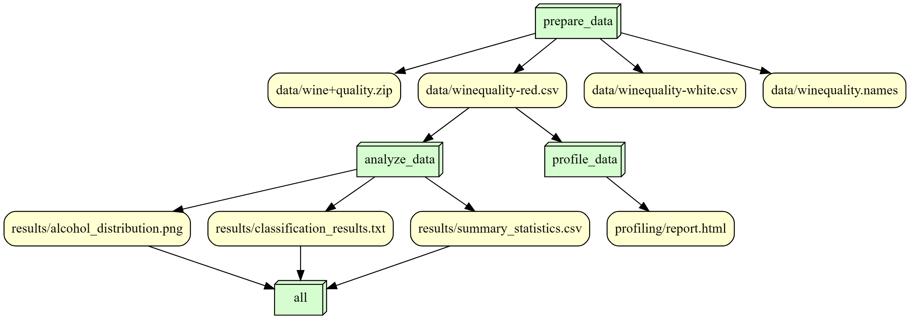

# is477-fall2023-final-project

## Overview

The project focuses on modeling wine quality based on physicochemical tests using two datasets related to red and white vinho verde wine samples from the north of Portugal. The dataset, sourced from [Cortez et al., 2009], includes various features such as acidity, residual sugar, and alcohol content, with wine quality being the target variable.

The analysis involves preprocessing the data, ensuring the 'quality' column is numeric. Subsequently, summary statistics for 'alcohol' and 'quality' are computed and saved to 'results/summary_statistics.csv'. For a simple analytical task, a Random Forest classification model is trained on the 'quality' column, and its accuracy is evaluated on a test set. The classification results, including accuracy and a detailed report, are saved to 'results/classification_results.txt'.

Additionally, a simple visualization is generated, depicting the distribution of alcohol content in the dataset. This histogram is saved as 'results/alcohol_distribution.png'. The entire analysis offers insights into the key features influencing wine quality and provides a classification model for predicting wine quality based on the given physicochemical attributes.

## Analysis

The mean alcohol content is approximately 10.42, while the average wine quality is around 5.64, indicating a moderate quality. The classification results reveal an overall accuracy of 65.94% for predicting wine quality using a Random Forest model. The classification report further breaks down the model's performance across different quality levels, showing varying precision, recall, and F1-score values. Notably, the model performs well in classifying wines with quality scores of 5 and 6 but struggles with extreme values such as 3, 4, and 8. The alcohol_distribution.png shows the frequency of alcohol percentage. The histogram is centered at 9.5% and skewed to the right.

## Workflow

## Reproducing

To reproduce the environment and run the script follow the instructions below
1. Environment Information:
    Microsoft Windows [Version 10.0.22621.2715]
    Python 3.10.6
2. Install the Dependencies
  Run the following to optain the required python packages:
   pip install -r requirements.txt
3. Run the scripts
  
  - python scripts/prepare_data.py
  - python scripts/profile.py
  - python scripts/analysis.py
  Now the environment should be replicated and the script ran without issues. 
  The accuracies, descriptive statics, and the frequencies of Alcohol percentage should have been recorded in the results folder.

## license
MIT License

Copyright (c) 2023 kcruz27

Permission is hereby granted, free of charge, to any person obtaining a copy
of this software and associated documentation files (the "Software"), to deal
in the Software without restriction, including without limitation the rights
to use, copy, modify, merge, publish, distribute, sublicense, and/or sell
copies of the Software, and to permit persons to whom the Software is
furnished to do so, subject to the following conditions:

The above copyright notice and this permission notice shall be included in all
copies or substantial portions of the Software.

THE SOFTWARE IS PROVIDED "AS IS", WITHOUT WARRANTY OF ANY KIND, EXPRESS OR
IMPLIED, INCLUDING BUT NOT LIMITED TO THE WARRANTIES OF MERCHANTABILITY,
FITNESS FOR A PARTICULAR PURPOSE AND NONINFRINGEMENT. IN NO EVENT SHALL THE
AUTHORS OR COPYRIGHT HOLDERS BE LIABLE FOR ANY CLAIM, DAMAGES OR OTHER
LIABILITY, WHETHER IN AN ACTION OF CONTRACT, TORT OR OTHERWISE, ARISING FROM,
OUT OF OR IN CONNECTION WITH THE SOFTWARE OR THE USE OR OTHER DEALINGS IN THE
SOFTWARE.

## References
Cortez, P., Cerdeira, A., Almeida, F., Matos, T., & Reis, J. (2009). Wine Quality. UCI Machine Learning Repository. https://doi.org/10.24432/C56S3T

Cortez, P., Cerdeira, A., Almeida, F., Matos, T., & Reis, J. (2009). Modeling wine preferences by data mining from physicochemical properties. Decision Support Systems

This dataset is licensed under a Creative Commons Attribution 4.0 International (CC BY 4.0) license.